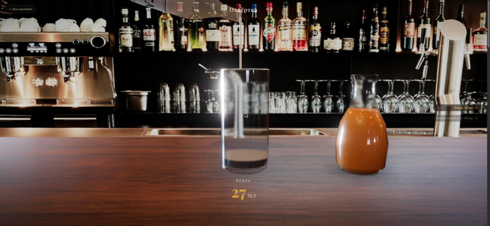
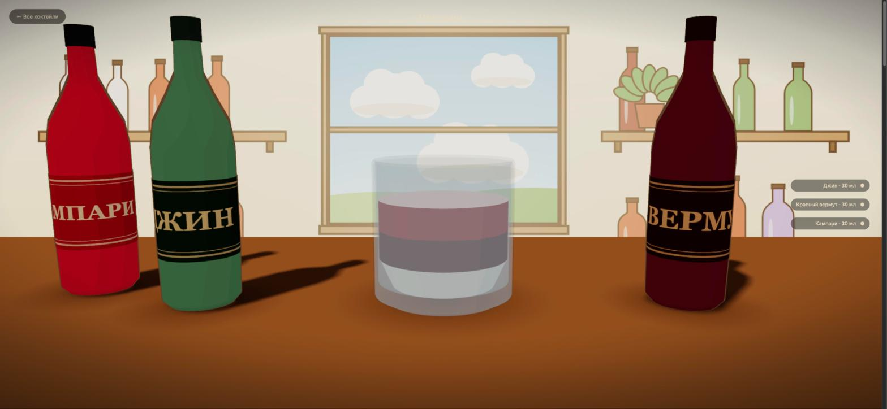

<div align="center">

# 🍸 Визуальный бар

**Интерактивные рецепты коктейлей: выбираете напиток — и «готовите» его скроллом.**

Пока вы листаете страницу, бутылки поднимаются, наклоняются и наливают ингредиенты
в стакан. Скролл назад отматывает всё в обратную сторону.


</div>

---

## Два стиля отображения

Переключаются кнопкой в меню, выбор запоминается.

| 🎬 Реализм | ✏️ Мультяшный |
|:---:|:---:|
|  |  |
| Стекло с преломлением, PBR-материалы, Cycles-задник с боке | Toon-шейдинг, чернильные контуры, рисованный фон в духе Гибли |

## Как это устроено

- **Вся посуда — процедурная** (`LatheGeometry`): стаканы, бутылки, графины строятся из профилей, без внешних 3D-ассетов.
- **Анимация — чистая функция прогресса скролла** (`src/main.js`): пауза, реверс и любая скорость скролла работают сами собой. Демпфирование даёт плавность, HUD показывает текущий ингредиент и счётчик миллилитров.
- **Каждый ингредиент — отдельный слой жидкости** в стакане, пропорции коктейля видны визуально.
- **Реализм**: transmission-стекло (честное преломление), HDRI-отражения, bloom; задний план — кадр этой же сцены, отрендеренный Blender Cycles с DOF (`blender/render_screwdriver.py --backdrop`), поэтому фото-боке достаётся бесплатно.
- **Мультяшный стиль** (`src/toon.js`): те же геометрия и анимация, но `MeshToonMaterial` со ступенчатым градиентом, контуры inverted-hull и рисованный canvas-задник — окно с облаками, полки с пастельными бутылками.

## Запуск

```bash
npm install
npm run dev        # http://localhost:5173
```

Продакшен-сборка: `npm run build` (результат в `dist/`).

## Добавить коктейль

Каталог — `src/cocktails.js`. Новый коктейль — это простой объект:

```js
{
  id: 'mojito',
  name: 'Мохито',
  glass: 'highball',            // или 'rocks'
  swatch: 'linear-gradient(...)',
  ingredients: [
    {
      name: 'Ром', amount: 50,             // мл
      color: 0xf2e8c9, opacity: 0.3,       // как выглядит в стакане
      vessel: { shape: 'spirit', tint: 0xe8e2d0, label: 'РОМ', ... },
    },
    // ...
  ],
}
```

Сцена, анимация налива и HUD подхватят его автоматически.

## Blender-пайплайн

`blender/render_screwdriver.py` — Cycles-сцена, повторяющая таймлайн `src/main.js` 1:1:

```bash
# задник для realtime-режима (2560×1440)
blender -b -P blender/render_screwdriver.py -- --backdrop --width 2560 --height 1440 --samples 64

# превью одного кадра при прогрессе p
blender -b -P blender/render_screwdriver.py -- --still 0.55

# полная последовательность кадров для скролл-скраббинга «как видео»
blender -b -P blender/render_screwdriver.py -- --frames 240
```

Режим пре-рендеренных кадров (скраббинг последовательности вместо realtime)
сохранён в коде и включается полем `frames` у коктейля.

## Структура

```
src/
  main.js       — скролл → прогресс → позы бутылок, слои, струя, камера, HUD
  scene.js      — рендерер, свет, стойка, задники, постобработка, стили
  vessels.js    — процедурная посуда: стаканы, бутылки, графины, струя
  toon.js       — мультяшный стиль: toon-материалы, контуры, рисованный фон
  cocktails.js  — каталог коктейлей (данные)
blender/
  render_screwdriver.py — Cycles-сцена: задник и кадры для скраббинга
```
